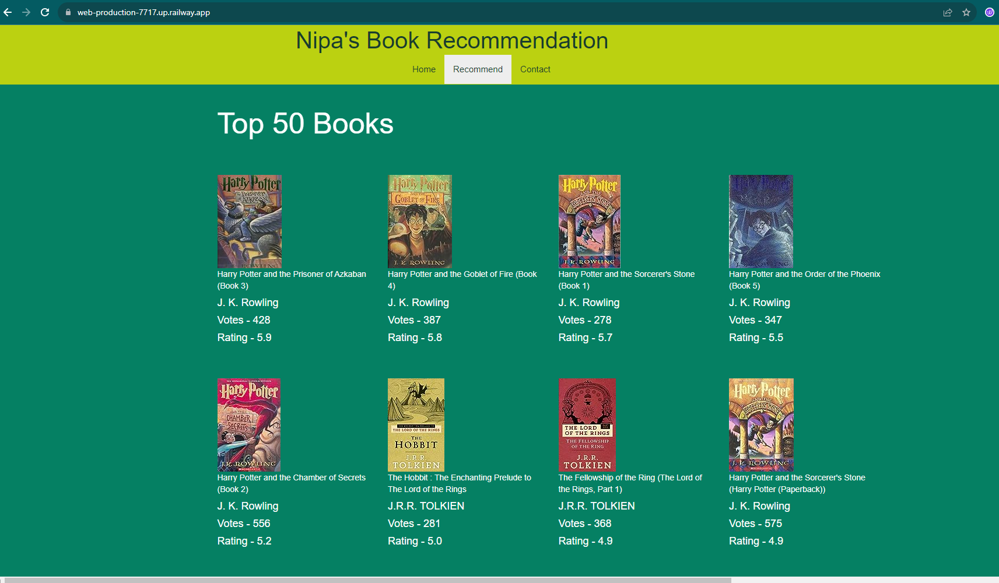

#  Dataset source:
https://www.kaggle.com/datasets/arashnic/book-recommendation-dataset
# Dataset Contents:
**Users**
Contains the users. Note that user IDs (User-ID) have been anonymized and map to integers. Demographic data is provided (Location, Age) if available. Otherwise, these fields contain NULL-values.

**Books**
Books are identified by their respective ISBN. Invalid ISBNs have already been removed from the dataset. Moreover, some content-based information is given (Book-Title, Book-Author, Year-Of-Publication, Publisher), obtained from Amazon Web Services. Note that in case of several authors, only the first is provided. URLs linking to cover images are also given, appearing in three different flavours (Image-URL-S, Image-URL-M, Image-URL-L), i.e., small, medium, large. These URLs point to the Amazon web site.

**Ratings**
Contains the book rating information. Ratings (Book-Rating) are either explicit, expressed on a scale from 1-10 (higher values denoting higher appreciation), or implicit, expressed by 0.

# Railway Deployment Link :
[https://studentsmathscoreprediction.azurewebsites.net/](https://web-production-7717.up.railway.app/)https://web-production-7717.up.railway.app/
# Screenshot of UI:

# Approach for the project :
The project is done based on "Collaborative Filtering" based recommendation system. Here the recommendation is not done just on the basis of items similarity. Rather, it recommends based on how the users rated the books. Let, we have a cluster of all the rated books. So, if we pick a book and want similar books like that, then, the euclidean distance of the nearest books will be cosiderd to recommend. Thats the logic.

From the dataset, I've taken account to those users who've rated minimum 200 books, to ensure that, they are valid users. Then, taken the books with rated minimum 50 times. Thus, the system gets intelligent with these criteri applied. After developing the whole recommendation system based on 'Collaborative Filtering' approach, I made a web application using Flask to have a smoother user experience of the book recommendation system. Finally deplyed that to 'Railway' platform.
